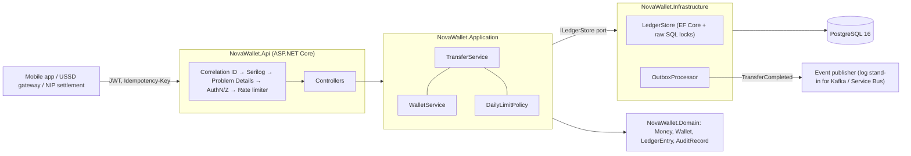

# NovaWallet Ledger Service

A wallet ledger for **FirstBank NovaPay's NovaWallet** module, written in C# / .NET 8 on PostgreSQL 16.
This is the component that must never lose, duplicate or miscount a customer's money, so the design puts correctness first:
- every balance decision is made while holding a database row lock;
- every request that moves money is idempotent;
- the database itself enforces the invariants the application relies on.

> Take-home task for the Backend Engineer (.NET) role, FirstBank Digital Factory. Author: Ikenna Odoh.
> How AI tools were used (and where they were wrong) is documented in [AI_USAGE.md](AI_USAGE.md).

---

## 1. Run it

```bash
docker compose up --build
```

That one command starts PostgreSQL and the API. Migrations run on startup.

| What | Where |
|---|---|
| Swagger UI / OpenAPI | http://localhost:8080/swagger  (spec: `/swagger/v1/swagger.json`) |
| Liveness / readiness | http://localhost:8080/health/live, http://localhost:8080/health/ready |
| PostgreSQL (for inspecting tables) | `localhost:5433`, db/user `novawallet`, password `novawallet-local-only` |

**End-to-end check.** With the stack running, this script exercises every capability (it needs `curl` and `jq`):

```bash
./scripts/smoke-test.sh http://localhost:8080
```

**Getting a token by hand.** Compose enables a *mock* issuer. Get a token from it, then click **Authorize** in Swagger:

```bash
curl -s -X POST localhost:8080/dev/token -H 'Content-Type: application/json' \
  -d '{"subject":"alice","role":"customer"}'      # role: customer | operator
```

<details>
<summary>A full flow with curl</summary>

```bash
T_ALICE=$(curl -s -X POST localhost:8080/dev/token -H 'Content-Type: application/json' -d '{"subject":"alice"}' | jq -r .accessToken)
T_BOB=$(curl -s -X POST localhost:8080/dev/token -H 'Content-Type: application/json' -d '{"subject":"bob"}' | jq -r .accessToken)
T_OPS=$(curl -s -X POST localhost:8080/dev/token -H 'Content-Type: application/json' -d '{"subject":"nip-settlement","role":"operator"}' | jq -r .accessToken)

A=$(curl -s -X POST localhost:8080/api/v1/wallets -H "Authorization: Bearer $T_ALICE" | jq -r .walletId)
B=$(curl -s -X POST localhost:8080/api/v1/wallets -H "Authorization: Bearer $T_BOB" | jq -r .walletId)

# Inbound NIP credit of ₦10,000 (operator only; idempotent on the NIP session reference)
curl -s -X POST localhost:8080/api/v1/wallets/$A/credit -H "Authorization: Bearer $T_OPS" \
  -H 'Content-Type: application/json' -d '{"amountKobo":1000000,"reference":"NIP000000000001"}'

# Transfer ₦2,500 (run it twice: the second response carries Idempotent-Replayed: true)
curl -si -X POST localhost:8080/api/v1/transfers -H "Authorization: Bearer $T_ALICE" \
  -H 'Content-Type: application/json' -H 'Idempotency-Key: 6f1c1f5e-4d0a-4c61-9d67-2d7e0b3a9a10' \
  -d "{\"sourceWalletId\":\"$A\",\"destinationWalletId\":\"$B\",\"amountKobo\":250000}"

curl -s localhost:8080/api/v1/wallets/$A/statement -H "Authorization: Bearer $T_ALICE" | jq
curl -s localhost:8080/api/v1/wallets/$A/audit -H "Authorization: Bearer $T_OPS" | jq '.chainIntact'
```
</details>

**Without Docker.** You need the .NET 8 SDK and any PostgreSQL 14+ server.

```bash
ConnectionStrings__Ledger="Host=localhost;Port=5432;Database=novawallet;Username=postgres" \
  dotnet run --project src/NovaWallet.Api      # Development settings: migrations + mock issuer on
```

## 2. Test it

```bash
dotnet test
```

| Suite | Count | What it covers |
|---|---|---|
| `NovaWallet.UnitTests` | 45 | `Money` arithmetic and overflow, WAT day boundaries, daily-limit edge cases, audit hash chain, request validation, transfer orchestration against an in-memory store (lock order, replay, rejection caching) |
| `NovaWallet.IntegrationTests` | 46 | The full HTTP pipeline against **real PostgreSQL**: concurrency under load, idempotency, auth, validation, Problem Details, pagination, append-only triggers, CHECK constraints, outbox, rate limiting, health, OpenAPI |

Integration tests start PostgreSQL with **Testcontainers**, so Docker is required; CI runs them this way.
Without Docker, point them at any server and they create and drop a throwaway database:

```bash
NOVAWALLET_TEST_DB="Host=localhost;Port=5432;Username=postgres;Database=postgres" dotnet test
```

### Concurrency evidence

`ConcurrencyTests` releases requests at the same instant through the real HTTP pipeline:

| Test | Scenario | Asserted outcome |
|---|---|---|
| Overdraw / double-spend | 200 parallel ₦100 transfers from a ₦1,000 wallet | exactly **10** × 201, **190** × 422 `insufficient_funds`; balance 0; ledger sum = balance; no negative running balance |
| Deadlock | 100 A→B and 100 B→A transfers at once | all 200 succeed; money conserved |
| Idempotency race | 50 parallel requests with the **same** key | one transfer; 49 replays of the identical receipt |
| Daily limit race | 40 parallel ₦20,000 transfers, ₦500,000 limit | exactly **25** succeed; 15 × `daily_limit_exceeded` |
| Fan-in | 20 senders → 1 wallet | every credit lands |

On an Apple M1 with local PostgreSQL 16, the 200-request test takes about 250 ms and the 200 opposing transfers about 730 ms. Results were identical across three runs.

**Do the tests actually catch regressions?** I checked by breaking the code on purpose (a manual mutation test):

| Change | Result |
|---|---|
| Removed `FOR UPDATE` from the wallet lock | 4 of 5 concurrency tests failed. **199 of 200** ₦100 transfers "succeeded" from a ₦1,000 wallet (lost updates); the daily-limit test let 40 of 40 through. |
| Removed the lock ordering | The opposing-transfers test failed with PostgreSQL `40P01 deadlock detected`. |

## 3. API

All endpoints need a JWT bearer token except health, Swagger and the mock issuer. All amounts are **integers in kobo**.

| Method | Path | Who | Notes |
|---|---|---|---|
| POST | `/api/v1/wallets` | customer (own) / operator (any `customerId`) | 201; 409 if the customer already has a wallet |
| GET | `/api/v1/wallets/{id}` | owner / operator | |
| GET | `/api/v1/wallets/{id}/balance` | owner / operator | `balanceKobo`, `currency: NGN`, `balanceDisplay: ₦7,500.00` |
| POST | `/api/v1/wallets/{id}/credit` | **operator** | Simulated inbound NIP. Idempotent on `reference` (NIP session id) |
| POST | `/api/v1/transfers` | owner of source | **`Idempotency-Key` header required**; rate-limited per customer |
| GET | `/api/v1/wallets/{id}/statement?limit=&cursor=` | owner / operator | Newest first, keyset pagination (`nextCursor`) |
| GET | `/api/v1/wallets/{id}/audit` | **operator** | Append-only audit trail + `chainIntact` verification |
| POST | `/dev/token` | anonymous | Mock issuer. Only exists when `Jwt__EnableDevTokenIssuer=true` |
| GET | `/health/live`, `/health/ready` | anonymous | Readiness checks the database |

Every error is an RFC 7807 `application/problem+json` body. Clients should branch on the stable `code` field, not on the message:

```json
{
  "type": "https://novawallet.example/problems/insufficient_funds",
  "title": "Insufficient funds",
  "status": 422,
  "detail": "The source wallet does not have enough funds for this transfer.",
  "instance": "/api/v1/transfers",
  "code": "insufficient_funds",
  "traceId": "4fb16c3d438d0ac2214f08758698a8f6",
  "correlationId": "4fb16c3d438d0ac2214f08758698a8f6"
}
```

| Status | `code` |
|---|---|
| 400 | `validation_error`, `invalid_amount`, `same_wallet_transfer`, plus model-binding errors |
| 401 | missing, expired or invalid token |
| 403 | `forbidden` |
| 404 | `wallet_not_found` (also returned for other customers' wallets, so ids can't be probed) |
| 409 | `wallet_already_exists`, `duplicate_reference` |
| 422 | `insufficient_funds`, `daily_limit_exceeded`, `idempotency_key_reused` |
| 429 | `rate_limited` (with `Retry-After`) |
| 500 | `internal_error` (no internals leaked; quote the correlation id) |

## 4. Architecture



- **Domain** has no dependencies. `Money` is a `long` of kobo with `checked` arithmetic; the entities guard their own invariants.
- **Application** holds the use cases and all business rules. It depends only on the `ILedgerStore` port, so orchestration can be unit-tested with an in-memory store.
- **Infrastructure** holds EF Core mappings, migrations, the locking SQL and the outbox worker.
- **Api** handles transport concerns only: auth, validation, Problem Details, rate limiting, logging, health, OpenAPI.

### Data model (all amounts `bigint` kobo)

| Table | Purpose | Guards |
|---|---|---|
| `wallets` | One per customer; current balance | `CHECK (balance_kobo >= 0)`, `CHECK (currency = 'NGN')`, unique `customer_id` |
| `ledger_transactions` | One row per business event (credit / transfer) | `CHECK (amount_kobo > 0)`, transfer shape check, unique `reference`, **append-only trigger** |
| `ledger_entries` | Double-entry lines with running `balance_after_kobo`; source of the statement | `CHECK`s, **append-only trigger** |
| `audit_log` | One row per balance mutation: before / delta / after, actor, correlation id, SHA-256 hash chain | `CHECK (before + delta = after)`, **append-only trigger** (UPDATE / DELETE / TRUNCATE rejected) |
| `idempotency_keys` | PK `(scope, key)`; request hash; stored outcome and response | |
| `outbox_messages` | `TransferCompleted` events written in the same transaction | partial index on unprocessed rows |

### How a transfer works

Everything below happens in **one** database transaction at READ COMMITTED:

1. **Claim the idempotency key.** Run `INSERT … ON CONFLICT DO NOTHING` on `(customer, key)`.
   - If another request holds the same key and hasn't committed yet, this statement blocks on the primary-key index until it does.
   - If the key already exists: a different request hash returns **422**. The same hash returns the stored result, with `Idempotent-Replayed: true`.
2. **Lock both wallets** with `SELECT … FOR UPDATE`, **always lower id first**. Two opposing transfers therefore queue instead of deadlocking.
3. While holding the locks, **check the rules**:
   - the caller owns the source wallet;
   - the destination exists;
   - the balance is sufficient;
   - today's outbound total (from the ledger since 00:00 WAT) + amount ≤ limit.
4. **Write everything.** Update both balances, then insert the transaction, two ledger entries, two audit rows (each chained to that wallet's previous hash) and one outbox event.
5. **Store the response** on the idempotency row, then **commit**.
6. **If a business rule fails**, discard the pending writes, store the *rejection* against the key, commit (which releases the locks) and return the error. An unexpected failure (for example a DB outage) rolls everything back, including the key, so the client can safely retry.

## 5. Key decisions and trade-offs

| Decision | Why | Trade-off / alternative considered |
|---|---|---|
| **Integers in kobo** (`long` / `bigint`) end to end; `checked` arithmetic; strict JSON (`100.5` or `"100"` rejected) | No floating-point drift. An overflow throws instead of wrapping. | Amounts above 2^53 would lose precision in JavaScript clients, so a per-transaction maximum (₦100m) keeps values well below that. |
| **Pessimistic row locks** (`SELECT … FOR UPDATE`) | Simple to reason about and to defend. Correct under any interleaving, including the daily-limit check. | *Optimistic concurrency* (row version plus retry) wastes work under contention on hot wallets. *SERIALIZABLE* is also correct but needs retry loops for serialization failures. A conditional `UPDATE … WHERE balance >= amount` is atomic, but it can't cover the daily-limit sum. |
| **Deterministic lock order** | Prevents deadlocks between opposing transfers (proven by the mutation test). | None worth noting. |
| **DB-level defence in depth**: `CHECK (balance_kobo >= 0)`, append-only triggers | Even a future bug, or a manual SQL session, can't create a negative balance or rewrite history. | Triggers can be disabled by the table owner. In production the app role would get only `SELECT, INSERT` on the ledger and audit tables. |
| **Idempotency keys scoped per customer, stored in the same transaction** | A concurrent duplicate blocks and then replays. A crash never leaves a "half-claimed" key. | Rejections are cached too (Stripe-style), so after a top-up the client must use a *new* key. Key expiry (e.g. 24 h) is not yet implemented; `created_at` is indexed for that job. |
| **Daily limit derived from the ledger** (not a separate counter) | There is a single source of truth, and it is evaluated under the sender's lock. | One indexed range-sum per transfer; a counter table would be cheaper at very high volume. WAT is a fixed UTC+1 (Nigeria has no DST), so behaviour doesn't depend on tzdata in the container. |
| **Audit log = separate append-only table + per-wallet SHA-256 hash chain** | Tampering is detectable (`GET …/audit` returns `chainIntact`). Written in the same transaction as the balance change. | The chain is per wallet because the wallet lock is what serialises writers; a global chain would need a global lock. Timestamps are truncated to microseconds so hashes survive the PostgreSQL round trip. |
| **Double-entry ledger entries** with running balance | The statement is a cheap keyset scan, and balances can be reconciled against entries. | A credit has a single entry; its contra side is the NIP settlement account, which is out of scope. |
| **Transactional outbox** + `FOR UPDATE SKIP LOCKED` poller | No lost or phantom `TransferCompleted` events. Safe with several replicas. | At-least-once delivery: consumers de-duplicate on `eventId`. The publisher logs instead of calling a real broker. |
| **Receipt returns only the caller's balance** | A sender must not learn the recipient's balance. | None worth noting. |
| **Other customers' wallets return 404** | Wallet ids can't be enumerated. | None worth noting. |
| **Migrations on startup** (compose / dev only) | Satisfies the single-command start. | In production this would be a separate migration job, since concurrent replicas would race. |
| **No `EnableRetryOnFailure`** | EF's retrying execution strategy is incompatible with user-initiated transactions. | Transient failures surface as 500. The client retries with the same idempotency key, which is safe. |

## 6. Security and Nigerian operating context

- **AuthN / AuthZ.** JWT bearer auth checks issuer, audience, lifetime (30 s skew) and signature. The algorithm is pinned to HS256, so `alg: none` is rejected (there's a test for it). Claims are not remapped (`sub`, `role`). A fallback policy makes every endpoint require authentication unless it opts out. Credits and audit access require the `operator` role, and ownership is checked in the application layer.
- **Mock issuer.** `/dev/token` exists only when `Jwt__EnableDevTokenIssuer=true` and logs a warning at startup. In production, tokens would come from the bank's IdP with asymmetric keys discovered via JWKS.
- **Secrets.** The signing key and DB password come from the environment. Startup fails if the key is under 32 bytes. Compose defaults are clearly local-only (see `.env.example`); real deployments would use a secret store.
- **Input validation.**
  - Model validation plus application-level guards, and unknown JSON fields are rejected.
  - Idempotency keys, references, customer ids and correlation ids are restricted to `[A-Za-z0-9_-]`, which also prevents log injection.
  - Narration is length-limited and control characters are rejected.
  - Page size is capped.
- **Abuse.** Transfers are rate-limited per customer and return 429 with `Retry-After`.
- **NDPA 2023.**
  - The service stores no BVN, NIN, names or phone numbers, only an opaque customer id.
  - Request bodies are never logged.
  - Logs carry wallet ids, subject and correlation id.
  - Audit records are the lawful-basis evidence trail and have no foreign keys, so they can outlive the wallet.
- **CBN context.**
  - The daily outbound limit is configurable. Tiered KYC (Tier 1/2/3 limits on single transactions, daily totals and maximum balance) would plug in as a per-wallet limit profile, and is noted as next work.
  - The immutable audit trail and correlation ids support dispute resolution under the consumer-protection framework.
- **Channels.** USSD (*894#) and flaky mobile networks cause retries and timeouts. That is exactly why the transfer is idempotent and why a replay returns the original result rather than an error. The USSD gateway can pass its session id as `X-Correlation-ID`.
- **Transport.** The container serves HTTP on 8080. TLS terminates at the ingress / API gateway.

## 7. Assumptions

- One NGN wallet per customer (`customerId` = the token's `sub`).
- "Credit wallet (simulating an inbound NIP transfer)" is a system-to-system call. It is therefore restricted to an `operator` role, and the NIP session id is the idempotency reference.
- Transfers are between wallets in this ledger. Outbound NIP to other banks is out of scope.
- The ₦500,000 limit applies to outbound wallet-to-wallet transfers (credits don't count). It resets at 00:00 WAT (UTC+1).
- A transfer's `Idempotency-Key` must be 8–64 characters of `[A-Za-z0-9_-]` (a UUID is recommended).
- Both the first call and a replay return **201**, with `Idempotent-Replayed: true|false` telling them apart.
- The audit trail is exposed read-only to operators through the API, and reviewers can also query `audit_log` directly in PostgreSQL.

## 8. What I would do next

1. Idempotency-key expiry job and a reconciliation job (Σ entries = balance; verify hash chains nightly).
2. KYC tier limit profiles (per-transaction, daily and maximum-balance caps) sourced from the customer service.
3. Reversal / chargeback flow as compensating entries (never updates).
4. Real broker (Kafka / Azure Service Bus), OpenTelemetry traces and metrics, and alerts on 5xx and outbox lag.
5. Least-privilege DB roles, migrations as a pipeline step, and table partitioning of `ledger_entries` / `audit_log` by month.
6. Asymmetric JWT via JWKS; mTLS for the NIP settlement integration.

## 9. Repository layout

```
src/
  NovaWallet.Domain/          Money, Wallet, LedgerTransaction/Entry, AuditRecord (+ chain verify), errors
  NovaWallet.Application/     TransferService, WalletService, DailyLimitPolicy, RequestGuard, ILedgerStore
  NovaWallet.Infrastructure/  LedgerDbContext, LedgerStore (locks, idempotency SQL), migrations, outbox
  NovaWallet.Api/             Controllers, JWT setup, Problem Details, rate limiting, correlation id, Program.cs
tests/
  NovaWallet.UnitTests/         45 tests
  NovaWallet.IntegrationTests/  46 tests (PostgreSQL via Testcontainers or NOVAWALLET_TEST_DB)
scripts/smoke-test.sh         end-to-end check used by CI against `docker compose up`
.github/workflows/ci.yml      build + all tests; compose smoke test
docs/                         presentation deck
```
