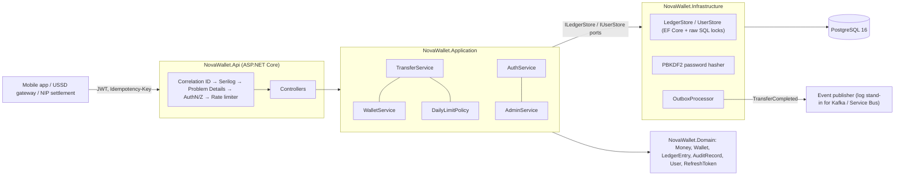

# NovaWallet Ledger Service

A wallet ledger for **FirstBank NovaPay's NovaWallet** module, written in C# / .NET 8 on PostgreSQL 16.
This is the component that must never lose, duplicate or miscount a customer's money, so the design puts correctness first:
- every balance decision is made while holding a database row lock;
- every request that moves money is idempotent;
- the database itself enforces the invariants the application relies on.

Customers register and sign in with a password; administrators manage users, freeze wallets and read the audit trail.

> Take-home task for the Backend Engineer (.NET) role, FirstBank Digital Factory. Author: Ikenna Odoh.
> How AI tools were used (and where they were wrong) is documented in [AI_USAGE.md](AI_USAGE.md).

---

## 1. Run it

```bash
docker compose up --build
```

That one command starts PostgreSQL and the API. Migrations run on startup.

| What | Where |
|---|---|
| Swagger UI / OpenAPI | http://localhost:8080/swagger  (spec: `/swagger/v1/swagger.json`) |
| Liveness / readiness | http://localhost:8080/health/live, http://localhost:8080/health/ready |
| PostgreSQL (for inspecting tables) | `localhost:5433`, db/user `novawallet`, password `novawallet-local-only` |
| Seeded administrator (demo only) | `admin@novawallet.local` / `ChangeMe-Admin-2026!`. Override with `ADMIN_EMAIL` / `ADMIN_PASSWORD` in `.env` |

**Step-by-step manual testing,** mapped to every requirement: [docs/TESTING_GUIDE.md](docs/TESTING_GUIDE.md).

**End-to-end check.** With the stack running, this script exercises every capability (it needs `curl` and `jq`):

```bash
./scripts/smoke-test.sh http://localhost:8080
```

**Signing in by hand.** Register a customer, sign in, then click **Authorize** in Swagger and paste the `accessToken`:

```bash
curl -s -X POST localhost:8080/api/v1/auth/register -H 'Content-Type: application/json' \
  -d '{"email":"alice@example.com","password":"Alice-Passw0rd","fullName":"Alice"}'
curl -s -X POST localhost:8080/api/v1/auth/login -H 'Content-Type: application/json' \
  -d '{"email":"alice@example.com","password":"Alice-Passw0rd"}' | jq
```

<details>
<summary>A full flow with curl</summary>

```bash
login() { curl -s -X POST localhost:8080/api/v1/auth/login -H 'Content-Type: application/json' \
            -d "{\"email\":\"$1\",\"password\":\"$2\"}" | jq -r .accessToken; }
for u in alice bob; do
  curl -s -X POST localhost:8080/api/v1/auth/register -H 'Content-Type: application/json' \
    -d "{\"email\":\"$u@example.com\",\"password\":\"Demo-Passw0rd\"}" > /dev/null
done
T_ALICE=$(login alice@example.com Demo-Passw0rd)
T_BOB=$(login bob@example.com Demo-Passw0rd)
T_ADMIN=$(login admin@novawallet.local 'ChangeMe-Admin-2026!')

A=$(curl -s -X POST localhost:8080/api/v1/wallets -H "Authorization: Bearer $T_ALICE" | jq -r .walletId)
B=$(curl -s -X POST localhost:8080/api/v1/wallets -H "Authorization: Bearer $T_BOB" | jq -r .walletId)

# Inbound NIP credit of ₦10,000 (admin only; idempotent on the NIP session reference)
curl -s -X POST localhost:8080/api/v1/wallets/$A/credit -H "Authorization: Bearer $T_ADMIN" \
  -H 'Content-Type: application/json' -d '{"amountKobo":1000000,"reference":"NIP000000000001"}'

# Transfer ₦2,500 (run it twice: the second response carries Idempotent-Replayed: true)
curl -si -X POST localhost:8080/api/v1/transfers -H "Authorization: Bearer $T_ALICE" \
  -H 'Content-Type: application/json' -H 'Idempotency-Key: 6f1c1f5e-4d0a-4c61-9d67-2d7e0b3a9a10' \
  -d "{\"destinationWalletId\":\"$B\",\"amountKobo\":250000}"      # always sent from the signed-in user's wallet

curl -s localhost:8080/api/v1/wallets/$A/statement -H "Authorization: Bearer $T_ALICE" | jq
curl -s localhost:8080/api/v1/wallets/$A/audit -H "Authorization: Bearer $T_ADMIN" | jq '.chainIntact'
```
</details>

**Without Docker.** You need the .NET 8 SDK and any PostgreSQL 14+ server.

```bash
ConnectionStrings__Ledger="Host=localhost;Port=5432;Database=novawallet;Username=postgres" \
  dotnet run --project src/NovaWallet.Api      # Development settings: migrations + demo admin seeded
```

## 2. Test it

```bash
dotnet test
```

| Suite | Count | What it covers |
|---|---|---|
| `NovaWallet.UnitTests` | 75 | `Money` arithmetic and overflow, WAT day boundaries, daily-limit edge cases, audit hash chain, request validation, transfer orchestration against an in-memory store (lock order, replay, rejection caching), password and email rules, lockout, token rotation and reuse detection, wallet freeze, admin rules |
| `NovaWallet.IntegrationTests` | 78 | The full HTTP pipeline against **real PostgreSQL**: concurrency under load, idempotency, sign-up / sign-in / refresh / logout (including concurrent refresh), instant revocation on disable and role change, admin user management, wallet freeze, admin action log, validation, Problem Details, pagination, append-only triggers, CHECK constraints, outbox, rate limiting, health, OpenAPI |

Integration tests start PostgreSQL with **Testcontainers**, so Docker is required; CI runs them this way.
Without Docker, point them at any server and they create and drop a throwaway database:

```bash
NOVAWALLET_TEST_DB="Host=localhost;Port=5432;Username=postgres;Database=postgres" dotnet test
```

### Concurrency evidence

`ConcurrencyTests` releases requests at the same instant through the real HTTP pipeline:

| Test | Scenario | Asserted outcome |
|---|---|---|
| Overdraw / double-spend | 200 parallel ₦100 transfers from a ₦1,000 wallet | exactly **10** × 201, **190** × 422 `insufficient_funds`; balance 0; ledger sum = balance; no negative running balance |
| Deadlock | 100 A→B and 100 B→A transfers at once | all 200 succeed; money conserved |
| Idempotency race | 50 parallel requests with the **same** key | one transfer; 49 replays of the identical receipt |
| Daily limit race | 40 parallel ₦20,000 transfers, ₦500,000 limit | exactly **25** succeed; 15 × `daily_limit_exceeded` |
| Fan-in | 20 senders → 1 wallet | every credit lands |

On an Apple M1 with local PostgreSQL 16, the 200-request test takes about 250 ms and the 200 opposing transfers about 730 ms. Results were identical across three runs.

**Do the tests actually catch regressions?** I checked by breaking the code on purpose (a manual mutation test):

| Change | Result |
|---|---|
| Removed `FOR UPDATE` from the wallet lock | 4 of 5 concurrency tests failed. **199 of 200** ₦100 transfers "succeeded" from a ₦1,000 wallet (lost updates); the daily-limit test let 40 of 40 through. |
| Removed the lock ordering | The opposing-transfers test failed with PostgreSQL `40P01 deadlock detected`. |
| Removed the per-request user check on tokens | 4 auth/admin tests failed: disabled and demoted users kept access, and a token claiming a role the user doesn't have got through. |
| Removed `FOR UPDATE` from refresh-token rotation | **10 of 10** concurrent refreshes of one token succeeded (a stolen refresh token could be cloned). |

## 3. API

All endpoints need a JWT bearer token except sign-up, sign-in, token refresh, health and Swagger. All amounts are **integers in kobo**.

**Authentication**

| Method | Path | Who | Notes |
|---|---|---|---|
| POST | `/api/v1/auth/register` | anonymous | Creates a **customer** (never an admin). Password: 8–128 chars, at least one letter and one digit |
| POST | `/api/v1/auth/login` | anonymous | Returns a 15-minute `accessToken` and a 7-day `refreshToken`. Every failure is the same 401 `invalid_credentials`; 5 wrong passwords lock the account for 15 minutes |
| POST | `/api/v1/auth/refresh` | anonymous | Rotates the refresh token. Reusing an old one revokes the whole session |
| POST | `/api/v1/auth/logout` | signed in | Revokes the session the refresh token belongs to |
| GET | `/api/v1/auth/me` | signed in | Profile, role and wallet id |

Sign-up, sign-in and refresh are rate-limited per client IP.

**About `Idempotency-Key`.** It is a request header, not part of the transfer. The client generates a new unique value (a UUID is recommended) for each transfer it intends to make, and sends the **same** value again if it has to retry that transfer (for example after a timeout on a flaky mobile or USSD connection). The server then returns the original result, with `Idempotent-Replayed: true`, instead of moving the money twice. Reusing a key with a different body is rejected with 422 `idempotency_key_reused`.

**Wallets and transfers**

| Method | Path | Who | Notes |
|---|---|---|---|
| POST | `/api/v1/wallets` | customer (own) / admin (any registered `customerId`) | 201; 409 if the customer already has a wallet |
| GET | `/api/v1/wallets/{id}` | owner / admin | Includes `status` (`Active` / `Frozen`) |
| GET | `/api/v1/wallets/{id}/balance` | owner / admin | `balanceKobo`, `currency: NGN`, `balanceDisplay: ₦7,500.00` |
| POST | `/api/v1/wallets/{id}/credit` | **admin** | Simulated inbound NIP. Idempotent on `reference` (NIP session id) |
| POST | `/api/v1/transfers` | any customer with a wallet | Body: `destinationWalletId`, `amountKobo`, `narration?`. The **source is always the caller's own wallet** (taken from the token). **`Idempotency-Key` header required**; rate-limited per customer |
| GET | `/api/v1/wallets/{id}/statement?limit=&cursor=` | owner / admin | Newest first, keyset pagination (`nextCursor`) |
| GET | `/api/v1/wallets/{id}/audit` | **admin** | Append-only audit trail + `chainIntact` verification |

**Administration** (admin only; every change is written to the append-only admin action log)

| Method | Path | Notes |
|---|---|---|
| GET | `/api/v1/admin/users?email=&limit=&cursor=` | Search and page through users (with their wallet ids) |
| GET | `/api/v1/admin/users/{userId}` | One user |
| POST | `/api/v1/admin/users/{userId}/disable` `{reason}` | Blocks sign-in and kills existing tokens and sessions **immediately** |
| POST | `/api/v1/admin/users/{userId}/enable` | Re-enables the account |
| POST | `/api/v1/admin/users/{userId}/role` `{role}` | `admin` or `customer`. Old tokens stop working; the user signs in again |
| POST | `/api/v1/admin/wallets/{walletId}/freeze` `{reason}` | Debit hold: outbound transfers get 422 `wallet_frozen`; credits still land |
| POST | `/api/v1/admin/wallets/{walletId}/unfreeze` | Lifts the hold |
| GET | `/api/v1/admin/actions?limit=&cursor=` | The admin action log, newest first |

Admins can't disable or demote themselves, and the last active admin can't be removed (409 `admin_rule_violation`).

**Platform**

| Method | Path | Notes |
|---|---|---|
| GET | `/health/live`, `/health/ready` | Readiness checks the database |

Every error is an RFC 7807 `application/problem+json` body. Clients should branch on the stable `code` field, not on the message:

```json
{
  "type": "https://novawallet.example/problems/insufficient_funds",
  "title": "Insufficient funds",
  "status": 422,
  "detail": "The source wallet does not have enough funds for this transfer.",
  "instance": "/api/v1/transfers",
  "code": "insufficient_funds",
  "traceId": "4fb16c3d438d0ac2214f08758698a8f6",
  "correlationId": "4fb16c3d438d0ac2214f08758698a8f6"
}
```

| Status | `code` |
|---|---|
| 400 | `validation_error`, `invalid_amount`, `same_wallet_transfer`, plus model-binding errors |
| 401 | missing, expired, revoked or invalid token; `invalid_credentials`; `invalid_refresh_token` |
| 403 | `forbidden` (e.g. a customer calling an admin endpoint) |
| 404 | `wallet_not_found` (also returned for other customers' wallets, so ids can't be probed), `user_not_found` |
| 409 | `wallet_already_exists`, `duplicate_reference`, `email_already_registered`, `admin_rule_violation` |
| 422 | `insufficient_funds`, `daily_limit_exceeded`, `idempotency_key_reused`, `wallet_frozen` |
| 429 | `rate_limited` (with `Retry-After`) |
| 500 | `internal_error` (no internals leaked; quote the correlation id) |

## 4. Architecture



- **Domain** has no dependencies. `Money` is a `long` of kobo with `checked` arithmetic; the entities guard their own invariants.
- **Application** holds the use cases and all business rules, including sign-in, token rotation and the admin rules. It depends only on ports (`ILedgerStore`, `IUserStore`, `IPasswordHasher`, `ITokenIssuer`), so orchestration can be unit-tested with in-memory fakes.
- **Infrastructure** holds EF Core mappings, migrations, the locking SQL, the password hasher, the admin seeder and the outbox worker.
- **Api** handles transport concerns only: JWT issuing and validation, validation, Problem Details, rate limiting, logging, health, OpenAPI.

### Data model (all amounts `bigint` kobo)

| Table | Purpose | Guards |
|---|---|---|
| `wallets` | One per customer; current balance; `status` (`Active` / `Frozen`) with the freeze reason | `CHECK (balance_kobo >= 0)`, `CHECK (currency = 'NGN')`, a frozen wallet must have a reason, unique `customer_id` |
| `users` | Email (lower-cased, unique), optional name, PBKDF2 password hash, role, status, `token_version`, failed-login counter and lockout | `CHECK (email = lower(email))`, `CHECK (token_version >= 1)` |
| `refresh_tokens` | SHA-256 of each refresh token, its session `family_id`, expiry and revocation | unique hash |
| `admin_actions` | Who changed what, to whom, why, with the correlation id | **append-only trigger**, no foreign keys |
| `ledger_transactions` | One row per business event (credit / transfer) | `CHECK (amount_kobo > 0)`, transfer shape check, unique `reference`, **append-only trigger** |
| `ledger_entries` | Double-entry lines with running `balance_after_kobo`; source of the statement | `CHECK`s, **append-only trigger** |
| `audit_log` | One row per balance mutation: before / delta / after, actor, correlation id, SHA-256 hash chain | `CHECK (before + delta = after)`, **append-only trigger** (UPDATE / DELETE / TRUNCATE rejected) |
| `idempotency_keys` | PK `(scope, key)`; request hash; stored outcome and response | |
| `outbox_messages` | `TransferCompleted` events written in the same transaction | partial index on unprocessed rows |

### How a transfer works

Everything below happens in **one** database transaction at READ COMMITTED:

1. **Claim the idempotency key.** Run `INSERT … ON CONFLICT DO NOTHING` on `(customer, key)`.
   - If another request holds the same key and hasn't committed yet, this statement blocks on the primary-key index until it does.
   - If the key already exists: a different request hash returns **422**. The same hash returns the stored result, with `Idempotent-Replayed: true`.
2. **Lock both wallets** with `SELECT … FOR UPDATE`, **always lower id first**. Two opposing transfers therefore queue instead of deadlocking.
3. While holding the locks, **check the rules**:
   - the source is the caller's own wallet (resolved from the token before the transaction starts; the request can't name one);
   - the destination exists and isn't the caller's own wallet;
   - the balance is sufficient;
   - today's outbound total (from the ledger since 00:00 WAT) + amount ≤ limit.
4. **Write everything.** Update both balances, then insert the transaction, two ledger entries, two audit rows (each chained to that wallet's previous hash) and one outbox event.
5. **Store the response** on the idempotency row, then **commit**.
6. **If a business rule fails**, discard the pending writes, store the *rejection* against the key, commit (which releases the locks) and return the error. An unexpected failure (for example a DB outage) rolls everything back, including the key, so the client can safely retry.

## 5. Key decisions and trade-offs

| Decision | Why | Trade-off / alternative considered |
|---|---|---|
| **Integers in kobo** (`long` / `bigint`) end to end; `checked` arithmetic; strict JSON (`100.5` or `"100"` rejected) | No floating-point drift. An overflow throws instead of wrapping. | Amounts above 2^53 would lose precision in JavaScript clients, so a per-transaction maximum (₦100m) keeps values well below that. |
| **Pessimistic row locks** (`SELECT … FOR UPDATE`) | Simple to reason about and to defend. Correct under any interleaving, including the daily-limit check. | *Optimistic concurrency* (row version plus retry) wastes work under contention on hot wallets. *SERIALIZABLE* is also correct but needs retry loops for serialization failures. A conditional `UPDATE … WHERE balance >= amount` is atomic, but it can't cover the daily-limit sum. |
| **Deterministic lock order** | Prevents deadlocks between opposing transfers (proven by the mutation test). | None worth noting. |
| **DB-level defence in depth**: `CHECK (balance_kobo >= 0)`, append-only triggers | Even a future bug, or a manual SQL session, can't create a negative balance or rewrite history. | Triggers can be disabled by the table owner. In production the app role would get only `SELECT, INSERT` on the ledger and audit tables. |
| **Idempotency keys scoped per customer, stored in the same transaction** | A concurrent duplicate blocks and then replays. A crash never leaves a "half-claimed" key. | Rejections are cached too (Stripe-style), so after a top-up the client must use a *new* key. Key expiry (e.g. 24 h) is not yet implemented; `created_at` is indexed for that job. |
| **Daily limit derived from the ledger** (not a separate counter) | There is a single source of truth, and it is evaluated under the sender's lock. | One indexed range-sum per transfer; a counter table would be cheaper at very high volume. WAT is a fixed UTC+1 (Nigeria has no DST), so behaviour doesn't depend on tzdata in the container. |
| **Audit log = separate append-only table + per-wallet SHA-256 hash chain** | Tampering is detectable (`GET …/audit` returns `chainIntact`). Written in the same transaction as the balance change. | The chain is per wallet because the wallet lock is what serialises writers; a global chain would need a global lock. Timestamps are truncated to microseconds so hashes survive the PostgreSQL round trip. |
| **Double-entry ledger entries** with running balance | The statement is a cheap keyset scan, and balances can be reconciled against entries. | A credit has a single entry; its contra side is the NIP settlement account, which is out of scope. |
| **Transactional outbox** + `FOR UPDATE SKIP LOCKED` poller | No lost or phantom `TransferCompleted` events. Safe with several replicas. | At-least-once delivery: consumers de-duplicate on `eventId`. The publisher logs instead of calling a real broker. |
| **Source wallet taken from the token, never from the request** | Each customer has one wallet, so there is nothing to choose. Nobody can even *ask* to debit someone else's wallet; a body that includes `sourceWalletId` is refused with 400. (Suggested in review; the first version accepted a client-supplied source and relied on an ownership check.) | If customers ever get several wallets (e.g. NovaSave pockets), the request would name one again and the ownership check, still in place as defence in depth, would carry the load. |
| **Receipt returns only the caller's balance** | A sender must not learn the recipient's balance. | None worth noting. |
| **Other customers' wallets return 404** | Wallet ids can't be enumerated. | None worth noting. |
| **Migrations on startup** (compose / dev only) | Satisfies the single-command start. | In production this would be a separate migration job, since concurrent replicas would race. |
| **No `EnableRetryOnFailure`** | EF's retrying execution strategy is incompatible with user-initiated transactions. | Transient failures surface as 500. The client retries with the same idempotency key, which is safe. |
| **Auth built into the service** (register / login / refresh), not an external IdP | Keeps `docker compose up` to two light containers while still exercising real credentials, sessions and roles. | In a bank a dedicated IdP (e.g. Keycloak / Entra ID) with MFA would issue tokens and this service would only validate them (RS256 via JWKS). The token-validation path is the part that would stay. |
| **Short access tokens (15 min) + rotating refresh tokens with reuse detection** | A leaked access token is useful only briefly; a stolen refresh token is detected the moment either party uses an old copy. | Two tabs refreshing the same token at the same instant are treated as reuse and signed out (security over convenience). |
| **Per-request user lookup** (status, role, `token_version`) | Disabling a user or changing their role takes effect immediately, not when the token expires. | One primary-key read per request; a short cache would trade a few seconds of staleness for fewer reads. |
| **Identical 401 for every sign-in failure**, dummy hash for unknown emails, lockout after 5 failures, per-IP rate limit | Doesn't reveal which emails exist; slows password guessing. | Lockout can be abused to lock someone out for 15 minutes; a production system would add CAPTCHA / risk scoring. Registration does reveal an existing email (409), a usability trade-off noted here. |
| **Freeze = debit hold** | Matches how banks place fraud / dispute holds: money can still arrive. | A full freeze (no credits) would be a second status if compliance required it. |

## 6. Security and Nigerian operating context

- **Sign-in.**
  - Passwords are hashed with PBKDF2-HMAC-SHA512 (100,000 iterations, random salt) via ASP.NET Core's `PasswordHasher`; old hashes are upgraded on the next sign-in.
  - Every sign-in failure returns the same 401, unknown emails still run a hash comparison, and 5 failures lock the account for 15 minutes.
  - Refresh tokens are 256-bit random values; only their SHA-256 is stored. They rotate on every use, and reuse of an old one revokes the whole session.
- **Tokens.** Access tokens last 15 minutes. Validation checks issuer, audience, lifetime (30 s skew) and signature, with the algorithm pinned to HS256 (`alg: none` is rejected; there's a test). On every request the user must still be active and the token's role and `ver` must match the database, so disabling or re-roling a user is instant. Tokens carry no email or name.
- **Authorisation.** A fallback policy makes every endpoint require authentication unless it opts out. Admin endpoints, credits and audit access require the `admin` role, checked by policy **and** again in the application layer; ownership of wallets is checked in the application layer. Public sign-up can only create customers, and the first admin is seeded from configuration.
- **Admin safety.** Admins can't disable or demote themselves, the last active admin can't be removed (the check locks all admin rows so two admins can't race), and every admin action is written to an append-only log with the correlation id.
- **Secrets.** The signing key and DB password come from the environment. Startup fails if the key is under 32 bytes. Compose defaults are clearly local-only (see `.env.example`); real deployments would use a secret store.
- **Input validation.**
  - Model validation plus application-level guards, and unknown JSON fields are rejected.
  - Idempotency keys, references, customer ids and correlation ids are restricted to `[A-Za-z0-9_-]`, which also prevents log injection.
  - Narration is length-limited and control characters are rejected.
  - Page size is capped.
- **Abuse.** Transfers are rate-limited per customer, and sign-up / sign-in / refresh per client IP; both return 429 with `Retry-After`.
- **NDPA 2023.**
  - The service stores only what sign-in needs: an email, an optional display name and a password hash. No BVN, NIN or phone numbers; those belong to the KYC service.
  - Request bodies are never logged.
  - Logs carry wallet ids, subject and correlation id.
  - Audit records are the lawful-basis evidence trail and have no foreign keys, so they can outlive the wallet.
- **CBN context.**
  - The daily outbound limit is configurable. Tiered KYC (Tier 1/2/3 limits on single transactions, daily totals and maximum balance) would plug in as a per-wallet limit profile, and is noted as next work.
  - The immutable audit trail and correlation ids support dispute resolution under the consumer-protection framework.
- **Channels.** USSD (*894#) and flaky mobile networks cause retries and timeouts. That is exactly why the transfer is idempotent and why a replay returns the original result rather than an error. The USSD gateway can pass its session id as `X-Correlation-ID`.
- **Transport.** The container serves HTTP on 8080. TLS terminates at the ingress / API gateway.

## 7. Assumptions

- One NGN wallet per registered user. The wallet's `customerId` is the user's id (the token's `sub`).
- "Credit wallet (simulating an inbound NIP transfer)" is a system-to-system call. It is therefore restricted to the `admin` role (standing in for the settlement integration), and the NIP session id is the idempotency reference.
- Email verification, password reset and MFA/OTP are out of scope for this exercise.
- Transfers are between wallets in this ledger. Outbound NIP to other banks is out of scope.
- The ₦500,000 limit applies to outbound wallet-to-wallet transfers (credits don't count). It resets at 00:00 WAT (UTC+1).
- A transfer's `Idempotency-Key` must be 8–64 characters of `[A-Za-z0-9_-]` (a UUID is recommended).
- Both the first call and a replay return **201**, with `Idempotent-Replayed: true|false` telling them apart.
- The audit trail is exposed read-only to admins through the API, and reviewers can also query `audit_log` directly in PostgreSQL.

## 8. What I would do next

1. Idempotency-key expiry job and a reconciliation job (Σ entries = balance; verify hash chains nightly).
2. KYC tier limit profiles (per-transaction, daily and maximum-balance caps) sourced from the customer service.
3. Reversal / chargeback flow as compensating entries (never updates).
4. Real broker (Kafka / Azure Service Bus), OpenTelemetry traces and metrics, and alerts on 5xx and outbox lag.
5. Least-privilege DB roles, migrations as a pipeline step, and table partitioning of `ledger_entries` / `audit_log` by month.
6. Move sign-in to a dedicated IdP with OTP / MFA, email verification and password reset; validate its RS256 tokens via JWKS; mTLS (not a user account) for the NIP settlement integration.

## 9. Repository layout

```
src/
  NovaWallet.Domain/          Money, Wallet, LedgerTransaction/Entry, AuditRecord (+ chain verify), User, RefreshToken, AdminAction, errors
  NovaWallet.Application/     TransferService, WalletService, AuthService, AdminService, DailyLimitPolicy, ports
  NovaWallet.Infrastructure/  LedgerDbContext, LedgerStore, UserStore (locks, idempotency SQL), password hasher, admin seeder, migrations, outbox
  NovaWallet.Api/             Controllers (wallets, transfers, auth, admin), JWT issuing/validation, Problem Details, rate limiting, correlation id
tests/
  NovaWallet.UnitTests/         75 tests
  NovaWallet.IntegrationTests/  78 tests (PostgreSQL via Testcontainers or NOVAWALLET_TEST_DB)
scripts/smoke-test.sh         end-to-end check used by CI against `docker compose up`
.github/workflows/ci.yml      build + all tests; compose smoke test
docs/                         testing guide, presentation deck
```
